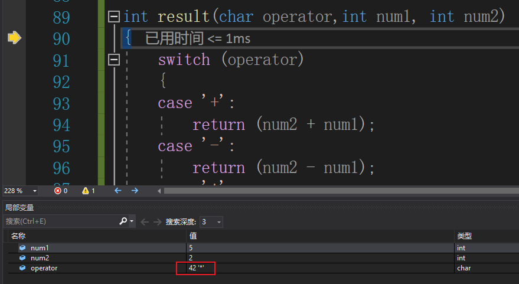

> Written with [StackEdit](https://stackedit.io/).

## 注意

**本例的表达式只能使用个位的数，大于等于10的数会出错**

## 问题

在 `main()` 中：

```c
char num1 = 0;    // 1字节
char num2 = 0;    // 1字节
char operator=0;  // 1字节
```

但 `Pop()` 函数期望的是 `datatype*`（即 `int*`，4字节）：

```c
LinkStack* Pop(LinkStack* top, datatype* value)  // datatype = int
{
    *value = top->data;  // 向地址写入 4 字节（int）！
    ...
}
```

当执行 `*value = top->data` 时，会向 `num1` 或 `num2` 的地址**写入 4 个字节**，但 `char` 变量只分配了 **1 个字节**！多出的 3 个字节会**覆盖相邻变量的栈内存**，破坏了栈保护Cookie，触发 "Stack around the variable 'num2' was corrupted"。

## 修复方案

将 `main()` 中的变量类型改为 `int`（或 `datatype`）

```c
// ❌ 错误：char 只占1字节，Pop函数写入4字节导致溢出
// char operator=0;
// char num1 = 0;
// char num2 = 0;

// ✅ 正确：与 datatype（int）保持一致
int operator = 0;
int num1 = 0;
int num2 = 0;
```

---

将operator改为int后以下代码逻辑还是可以实现功能

```c
int result(char operator,int num1, int num2)
{
	switch (operator)
	{
	case '+':
		return (num2 + num1);
	case '-':
		return (num2 - num1);
	case '*':
		return (num2 * num1);
	case '/':
		return (num2 / num1);
	default:
		break;
	}
}
```


