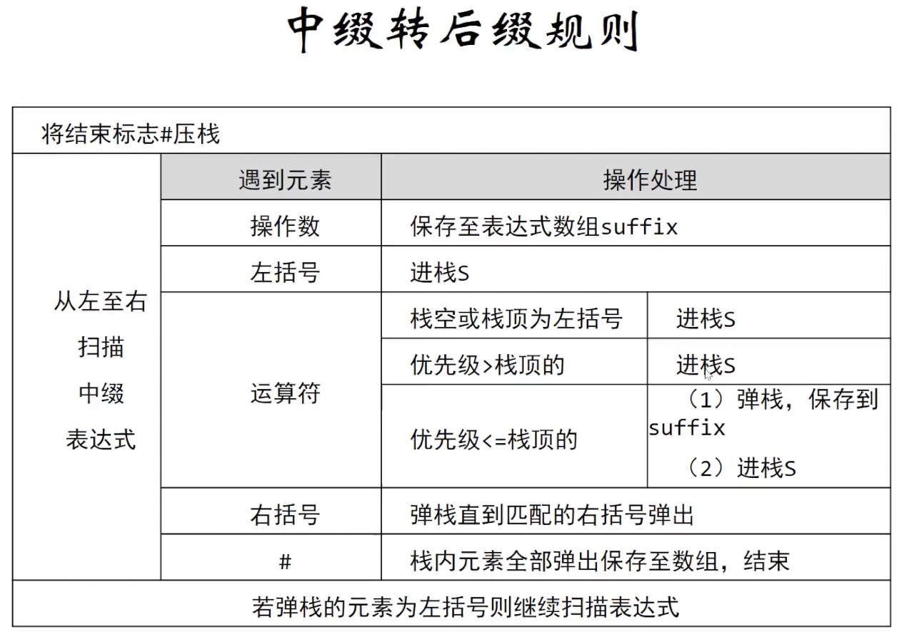
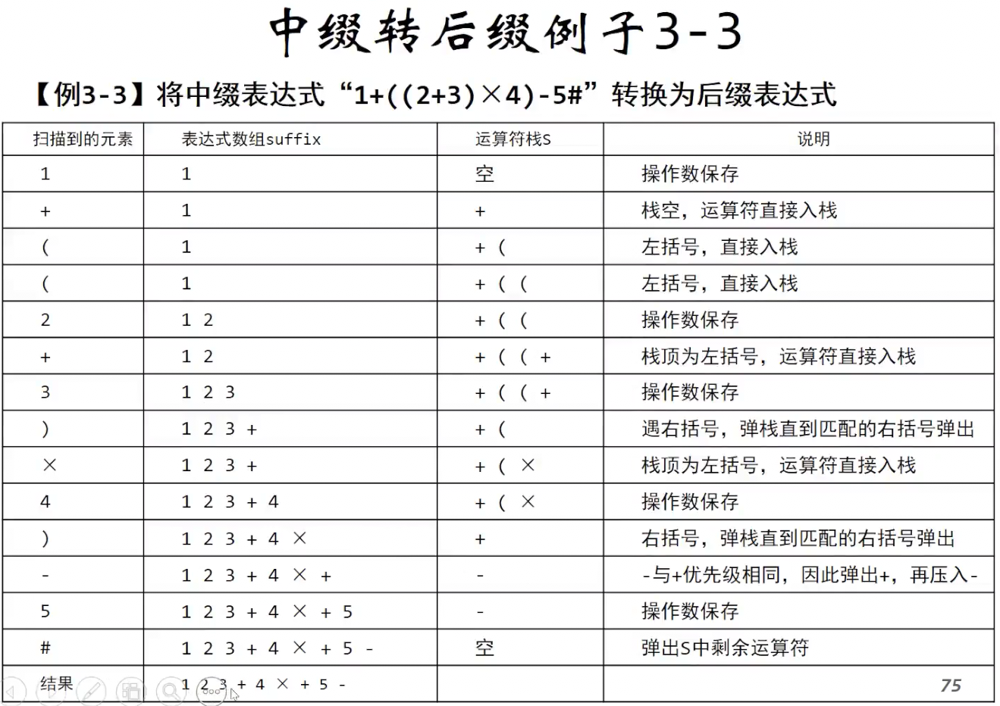

> Written with [StackEdit](https://stackedit.io/).




---

```c
if (isOperator(expression[index]) == TRUE)
{
	if (!isEmpty(operatorStack))
	{
		if (Priority(expression[index]) <= Priority(GetValue(operatorStack)))
		{
			operatorStack = Pop(operatorStack, &operator);
			enQueue(sufixQueue, operator);
			operatorStack = Push(operatorStack, expression[index]);
		}
		else
		{
			operatorStack = Push(operatorStack, expression[index]);
		}
	}
	else
	{
		operatorStack = Push(operatorStack, expression[index]);
	}
}
```

这段代码保证优先级高的运算先放入表达式中

---

```c
if (expression[index] == '(')
{
	operatorStack = Push(operatorStack, expression[index]);
}
else if (expression[index] == ')')
{
	if (!isEmpty(operatorStack))
	{
		while (1)
		{
			operatorStack = Pop(operatorStack, &operator);
			if (operator == '(')
			{
				break;
			}
			enQueue(sufixQueue, operator);
		}
	}
}
```

这段代码使得当遇到`)`时，找到`(`，并将中间的元素放进表达式中。保证括号中的表达式优先计算。
